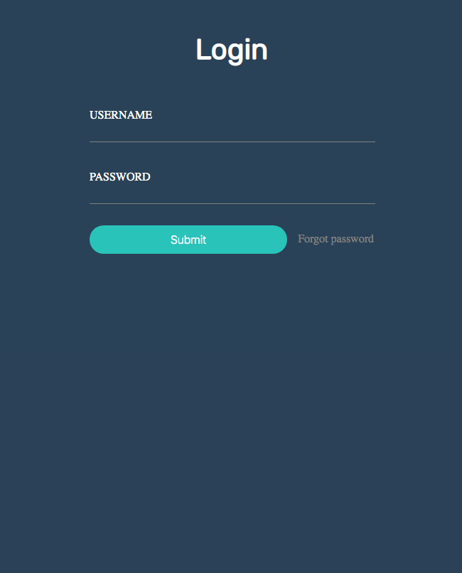
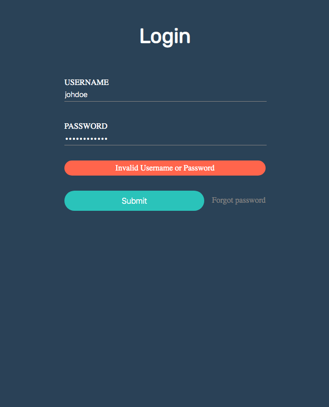
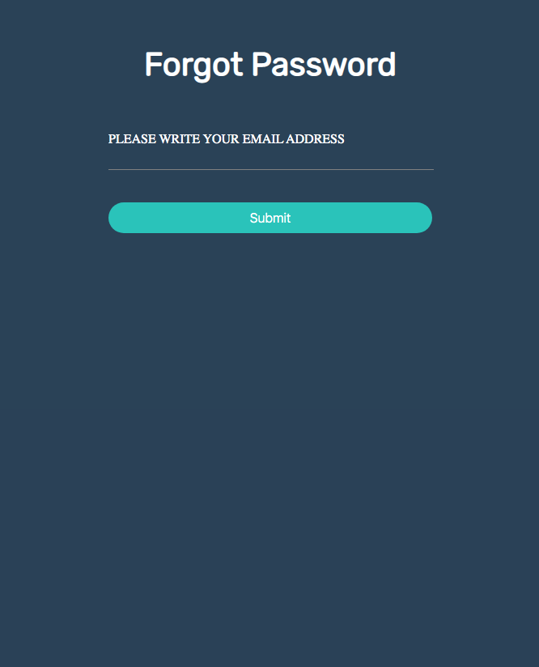
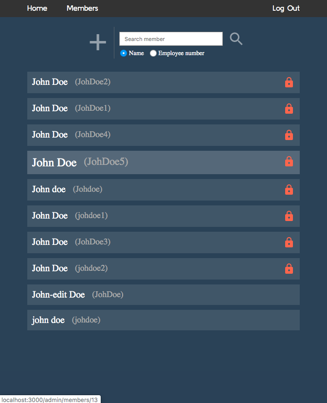
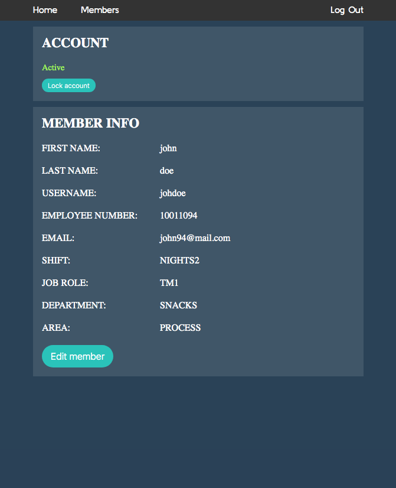
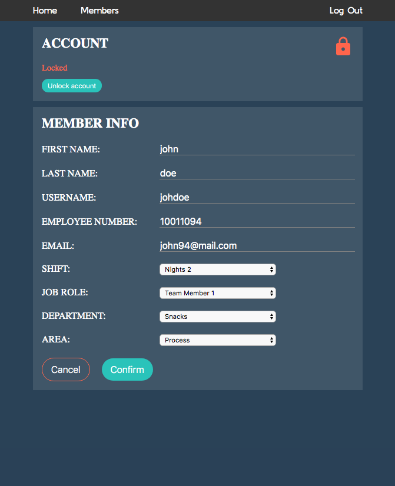
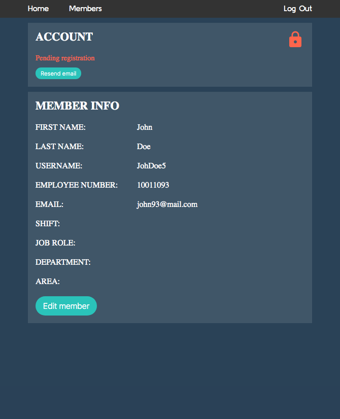
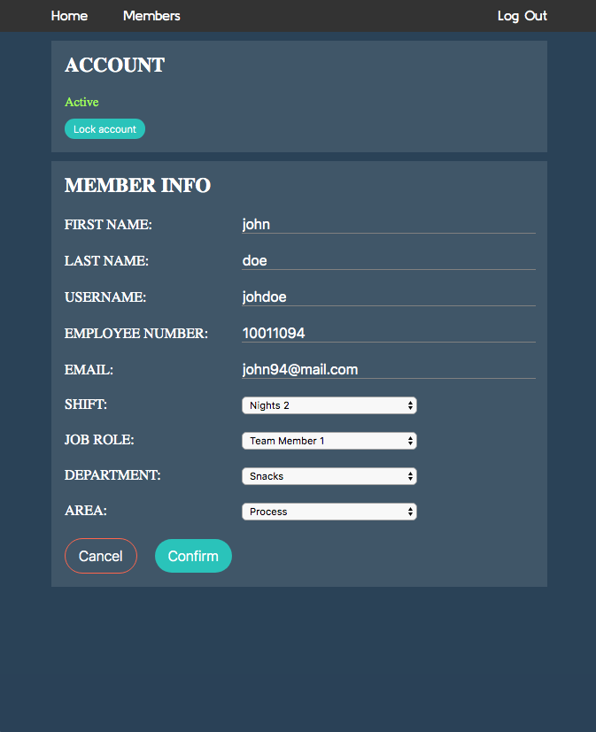
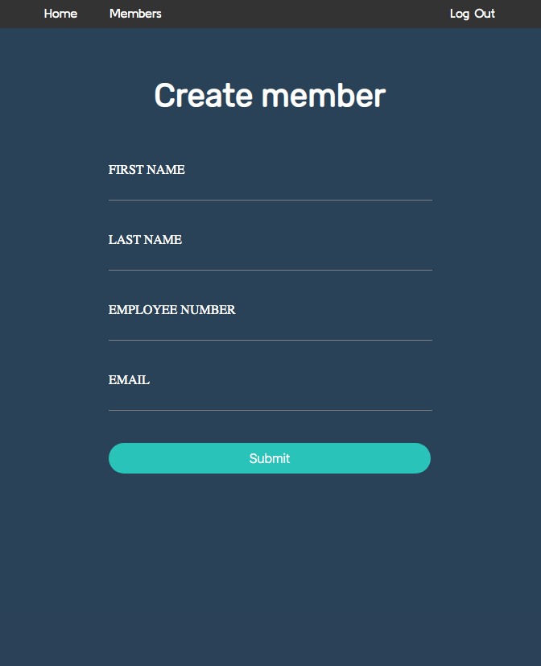

# Holiday booking app - in development

  - Finished user authentication and authorization (admin or user);
  - Finished user management (create user, edit user, lock user, unlock user, send registration mail); 
  
Stack: 
  
  Java | Springboot | Spring security | React.js | Typescript | Html | Css | Sass | 
  PostgreSQL | Junit | Jest | REST Api | Git | CircleCI | CodeCov | Maven

  
  
  
  
  
  
  
  
  

